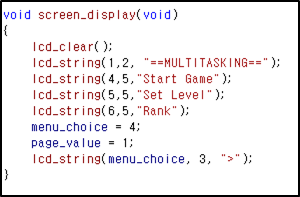

# Multitasking Game

## Ownership
    - 김권일
    - 김현태

## Role
    - 김권일 : Game, 예외처리
    - 김현태 : Board설계, 메뉴, Game

# Degine

## Main
 최초에 게임이 시작되면, 메뉴 화면이 뜨게 된다. 본 화면에서는 Start game, Set level, Rank을 선택 할 수 있게 되어있다. 
	
 먼저, main 함수이다. 게임이 시작되면, device를 초기화 하는데, interrupt, port 등을 사용할지 말지 선택하고, 초기화 한다. 그 후 screen_display() 함수를 호출 하는데, 본 함수는 다음과 같이 구성되어 있다.

