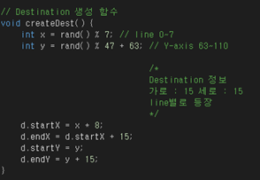

# Multitasking Game

## Ownership
    - 김권일
    - 김현태

## Role
    - 김권일 : Game, 예외처리
    - 김현태 : Board설계, 메뉴, Game

# Degine

## Main
 최초에 게임이 시작되면, 메뉴 화면이 뜨게 된다. 본 화면에서는 Start game, Set level, Rank을 선택 할 수 있게 되어있다. 
	
 먼저, main 함수이다. 게임이 시작되면, device를 초기화 하는데, interrupt, port 등을 사용할지 말지 선택하고, 초기화 한다. 그 후 screen_display() 함수를 호출 하는데, 본 함수는 다음과 같이 구성되어 있다.

 게임 이름과, 각종 메뉴를 화면에 출력하고, menu_choice를 4로 초기화 시킨다. 그리고 page_value라는 값을 1로 설정한다. 여기서, menu_choice변수와 page_value 변수는 전역변수로, 어떤 함수에서 접근하든 동일한 값을 얻을수 있도록 설정하였다. 다음으로, menu_choice값의 위치에 ">" 라는 화살표를 표시하여, 아래와 같이 현재 선택된 메뉴의 위치를 나타내도록 하였다. 

 page_value값의 설정은 다음과 같다. 최초 메인 메뉴 = 1, Set Level 메뉴 = 2, Rank 메뉴 = 3 이다. 이 값에 따라서 분기하는 방식이 달라진다.
 이어서 메인메뉴의 화면을 계속 설명하면, while문을 이용하여, 조이스틱의 움직임을 읽어오고, 메뉴 선택을 읽어오도록 하였다. 그리고 Rank메뉴인 경우, 선택할 메뉴가 없으므로, menu_choice값을 7로 고정시키도록 하였다. 그 이유는, 혹시라도 조이스틱을 만지게 되면, menu_choice가 변동 되게 되는데, ranking화면에서 이 값이 변하면, 메인메뉴로 돌아올 수 없기 때문이다. 자세한 내용은 이 후에 설명한다. 다음은 main 함수의 전문이다.

 위 그림에서 보다시피, 조이스틱 조정 함수는 menu_select() 함수를 이용하고, 메뉴 선택 화면은 select_menu() 함수를 이용한다. 다음은 menu_select() 함수, 즉, 조이스틱 조정 함수와 같다.

 본 함수에서, 조이스틱은 위, 아래로만 움직이면서 “>“ 를 움직일 것이므로, Data_ADC4 값만 읽어오면 된다. if문을 이용하여, menu_choice 값이 4~6으로 설정되게 하여, ”>“ 가 메뉴 이외의 위치로 옮겨가는 것을 방지한다. 내부에서는, menu_choice의 위치를 이동시켜줘서 ”>“ 를 찍어주고, 이전 위치의 ”>“ 는 삭제하여 화면에서 ”>“ 가 이동하게끔 해준다.
 다음은 select_menu() 함수이다.

 함수의 내용이 길기 때문에, 자세한 내용은 생략했다. 내용은 간단하고, 대부분 비슷하다. byte형 변수 key값을 선언하고, PIND에서 버튼을 눌릴 때의 값을 읽어와 key라는 변수에 저장한다. ATmega128 키트에서 가장 왼쪽에 있는 버튼을 눌리면, 이 key값에 254가 저장되게 되는데, 다음의 if문에서 그 값을 확인한다. (만일 입력 값이 없다면, 255가 기본적으로 설정되어 있음) 그와 동시에, page_value값을 확인하여, 현재 화면이 어떤 화면(main_menu, select_level, rank) 인지 확인한다. 위 그림에서는 Main_menu에 대한 선택화면이 나타나 있다. 조이스틱에서 조정한 menu_choice 변수의 값에 따라서, 각 화면으로 분기한다. 4번 즉, Start Game의 경우 start_game() 함수를 호출하여 Game 화면으로 넘어가는 함수, 그리고 5, 6번에 대해서는 각각 난이도 조정함수, ranking 함수로 넘어간다. 
 아래는 추가적인 분기 코드이다.

 page_value가 2 즉, select level의 화면의 경우에, menu_choice에 따라 모드를 설정한다. 화면에 난이도가 설정되었다는 문구를 출력하고, 주석처리 된 난이도 값을 설정해 주고, 3초뒤 메인화면으로 돌아간다.
 page_value가 3 즉, rank화면인 경우, 키가 눌러졌을 때, 메인화면으로 분기되도록 설정한다.

 다음은 Select Level 메뉴와 Rank 메뉴로 들어왔을 때 화면에 보여질 코드이다.

 Select Level을 선택할 경우, Select_menu() 함수에서 level_menu_lcd() 함수를 호출하게 된다. 본 함수에서는 page_value값을 2로 설정하여, 화면이 바뀌었다는 것을 전역변수로 알리고, menu_choice를 4로 세팅하여 “>”의 위치를 Easy 문자에 위치시킨다. 그리고 화면에 레벨 선택화면을 뿌려준다. 
 Rank를 선택할 경우, Select_menu() 함수에서 rank_menu_lcd() 함수를 호출하게 된다. 이 함수에서도 마찬가지로 page_value를 3으로 설정하여, 화면이 바뀌었다는 것을 전역변수로 알린다. 특이한 점은 menu_choice를 7로 설정한다는 점인데, 이는 선택할 메뉴가 없으므로, 값을 고정하겠다는 것이다. 이후, ranking을 화면에 표시하고, 버튼이 눌려질 때 까지 기다리게 된다.

 위 그림은 Start game을 선택하였을 때 실행되는 start_game() 함수이다. GLCD_Line() 함수를 이용하여 화면을 3개로 나눠준다. 우리 프로젝트의 게임인, Multitask라는 이름에 맞게, 3가지 게임을 동시에 진행하게 된다. 다음으로 startShipGame(), startJumpGame(), startBalanceGame() 라는, 각 게임 함수를 호출하여 나누어진 칸 마다 게임이 시작되도록 설정한다. 게임 자체가, 화면의 변화가 많이 필요한 게임이라, 화면에 다시 뿌려주는 작업이 반드시 필요한데, 이 때문에 while문을 사용하게 되었고, while문의 마지막에 0.25초라는 delay를 주어서, 화면을 0.25초마다 다시 뿌리도록 설계하였다. 매 while문이 반복 될 때마다, 게임이 끝나는 flag 변수인 endflag를 검사하여, 게임이 끝났는지 확인한다. 이 endflag가 set되는 경우는 이 후에 설명할 예정이다.
 endflag가 set되면, 패배 sound가 나오고, 화면에 패배라는 문구를 띄운다. 그리고 while문을 벗어나게 되는데, 딜레이를 3초를 줘서, 패배라는 문구가 3초간 유지되도록 하였다. 그 후, resetGame()이라는 함수를 통하여 게임에 필요한 변수들을 초기화 해주었고, write_rank() 함수를 이용해 랭킹을 계산하여 랭킹을 산정하도록 했으며, 메인 화면을 다시 뿌려주도록 screen_display() 함수를 호출하였다.

 이 프로젝트의 주가 되는 함수인 gaming 함수들은 잠깐 뒤로 미뤄두고, 간단한, write_rank() 함수에 대해 다뤄보겠다. 참고로 resetGame() 함수는 따로 다루지 않을 예정인데, 이유는 아주 간단하게, 변수의 초기화만 이루어지기 때문이다. 변수의 초기값은 앞으로 진행될 gaming 함수들에서 확인하도록 한다.

 위 함수는 write_rank() 함수이다. 전역변수인 int rank[5]를 이용하여, rank 값을 기억하도록 하는데, 이 rank값은 메인페이지의 rank메뉴에서 확인할 수 있다. 
 먼저, 이 함수에서 생각해 보아야 할 부분은 게임이 끝났을 때 저장되어있을 전역변수 score값과 rank값을 비교하는 부분이다. rank의 배열은 0~4번까지 내림차순으로 정렬되게 될 것인데, 차례대로 score값과 비교하며 score값의 위치를 찾게 될 것이다. 아래 그림을 참조하자.

 처음으로 해야 할 일은 buf라는 임시 변수에 rank의 값을 복사하는 것이다. rank값 하나만으로도 구현 가능하지만, 시간이 부족하여 알고리즘을 생각해내기가 힘들었다. 일단 눈에 보기 쉽게 위와 같이 가시적으로 코딩을 하였다. 그 후, score의 값을 rank의 내용과 차례대로 비교한다. 위 그림은 score값이 최고점수로 계산되었을 때를 가정한다. 그리고 그림과 같이, 3번째, 순위 값을 buf에서 하나씩 읽어와 rank에 1순위씩 내려 저장하도록 하고, 마지막으로 score의 값을 rank의 자신의 위치에 저장하도록 한다. 이 알고리즘을 구현한 것이 위의 write_rank() 함수이며, rank는 게임이 끝났을 때 산정되므로, score값을 0으로 초기화시켜주고, return을 시켜 함수를 종료시켜준다.

 자 이제 대망의 gaming 함수들을 볼 차례이다. 먼저, startShipGame() 함수부터 보도록 하자. 이 게임은 오른쪽에 표시될 게임으로, 자신의 상자를 제한시간 내에 조이스틱을 이용하여 랜덤으로 생성된 상자로 이동시키는 게임이다. 

 위 그림이 startShipGame() 함수의 내용이다. 최초에 이 함수가 시작되면 moveShip() 이라는 함수를 호출하게 되는데, 이 함수는 조이스틱 값을 읽어 화면의 본인 상자를 좌우상하로 움직이도록 해주는 함수이다. 본 함수에서 굉장히 애를 먹었는데, 그 이유는, _glcd.h 라는 헤더파일의 정의가 잘 못 되어서 x축으로 움직일 때마다 상자의 길이가 늘어나는 오류가 발생하였다. 
 이는 근본적으로 GLCD_Dot이 or연산을 통해 x축에 대한 line연산을 하기 때문이였는데, 이를 ScreenBuffer의 값을 직접 적용해서 만든 GLCD_Ship이란 함수를 만들어 해결하였다.

 다음은 moveShip() 함수의 내용이다.

 먼저 mode라는 변수를 확인해야한다. 이 변수는 메인메뉴의 Select level 메뉴에서 설정할 수 있는데, 이 값에 따라 난이도가 결정된다. 난이도가 높을수록 Ship이 움직이는 속도가 느려진다. 조이스틱 값을 RLswitch와 UDswitch로 읽어 와서 상하좌우에 따라 좌표값을 수정해 준 뒤, 위에서 설명한 GLCD_Ship이라는 수정된 함수 호출을 통해 화면에 그리도록 하였다.

 다시 startShipGame() 함수로 돌아와서, count를 설정하게 된다. count값은 40이 될 때마다 1초로 계산되는데, 그 이유는 start_game() 함수에서 0.25초마다 화면을 clear해주기 때문이다. count가 200이 넘어가면 0으로 초기화 시켜주고, 그게 아니면, count를 40으로 나눠서 나머지가 0인지를 확인한다. 즉 1초를 계산한다. 1초가 지나면, d.time변수를 1씩 깎는다. d 라는 구조체는 본 설명이 끝나고 설명하겠다. 그리고 전역변수이자 게임 점수인 score를 1씩 증가시킨다. 이 score는 이 ship 게임에서만 1씩 증가한다. 그리고 d.time을 검사하는데, 이 값이 초기에 5인 5초로 설정되어 있다. 근데 0까지 떨어지게 되면, 게임 종료 flag인 endflag를 1로 set한다.
 그리고, 나의 ship이 destination 상자에 도달했는지 확인하는 clearDest() 함수를 호출해서, 도달했다면, d.time을 5초로 초기화 시키고, 새로운 destination을 만들어주는 createDest() 함수를 호출한다.

 위는 전역변수와 각종 구조체들이다. 전역변수는 주석으로 설명을 달아 놓았다. 먼저 Ship 구조체부터 알아볼텐데, Ship 구조체는 우리가 움직일 Ship을 구성한다. 시작좌표와 끝좌표를 저장한다. Destination 구조체는 time값과 시작좌표, 끝좌표로 구성되어 있다. time은 위에서 말했던 d.time에서 사용되며, 각 시작좌표와 끝좌표는 그림을 그리는데 크기를 나타낸다.  그리고 아래의 structure 초기화에서 초기화를 한다.

 다시 startShipGame() 함수로 돌아와서, createDest() 함수를 확인한다. 이 함수에서는 destination 상자를 랜덤으로 좌표를 배정하여 d 구조체에 저장하도록 하였다.

 다음으로 clearDest() 함수이다. 본 함수에서는 Ship이라는 우리 ship 구조체가 위 destination에 도달했는지 확인한다. 만일 도달했다면, 1을 return 하도록 한다. 이로써 startShipGame() 함수는 다 설명하였다.

 다음으로는 startBalanceGame() 함수에 대해서 알아볼 것이다. 위 그림은 기본적인 balance 게임의 구조물에 대한 구조체이다. 이 게임은 가속도센서를 이용하여 ball을 control하는 게임이다.

tartBalanceGame() 함수이다. moveBar() 함수가 주 함수이고, 이 함수의 움직임에 따라 아래에서 생성할 object를 조절한다.

 위 함수가 moveBar() 함수가 이 게임의 주 함수로써, 가속도 센서를 읽어와서 이전에 존재하던 object를 지우고, 읽어온 값에 따라 ball과 bar의 위치를 저장하도록 구성되어 있다.
 이 함수는 앞선 ship에 비해 간단히 구성되었다. 이로써 이 게임의 설명은 끝났다.

마지막으로 startJumpGame() 함수를 설명할 차례이다. 본 게임은 조도센서를 이용하여 조도센서를 가려 어둡게 하면 jumper 구조체가 점프하고, 평소에는 가만히 있는 게임으로, 중간중간 나오는 구멍을 점프로 피하는 게임이다. 다음 그림은 jump game에 관련된 구조체 선언이다.

 Jumper는 ship과 같이 좌표로 구성되어져 있고, Ground는 땅을 이루는 구조체로써 시작과 끝을 나타낸다. 

 위 moveGround() 함수는 바닥을 움직이면서 구멍을 생성해주는 함수이다. 이 바닥은 계속해서 이동하며, 이를 start_game() 함수의 0.25초마다 clear_lcd를 할 때마다 이동하는 것처럼 보이도록 설정해준다. 

 위 함수가 실제 startJumpGame() 함수이다. 이 함수에서는 조도 센서의 값을 읽어와서 조도센서를 가릴때마다 jumping이라는 전역변수를 1로 설정하도록 코딩하였다. 여기서 jflag는 점프를 하고있는지 확인하는 flag변수로써 이 변수가 0이여야 점프를 안 하고있는 상태를 나타내는 것이다. jflag 변수는 jump()함수에서 점프 높이를 확인하는데 사용할 예정이다. 본 함수는 아래서 설명하겠다. 만일 jflag가 10이 되면, 점프가 끝난 상황이 된 것이므로, jflag를 0으로 초기화하고, jumping이라는 변수를 0으로 초기화한다.
 그리고 아래에서 jumper를 그려준다. 이 또한 위에서 설명하였듯이 교수님께서 제공해주신 헤더파일에서는 x좌표의 도트에 에러가 있으므로, 새로 만들어낸 GLCD_Ship함수를 이용하여 jumper를 그려주도록 하였다. 이후, moveGround() 함수와 clearJump() 함수를 호출하도록 한다.

 위 함수가 jump() 함수이다. 이 함수에서 jumper의 위치를 조절한다.

 위 함수는 clearJump() 함수이다. 이 함수에서 구멍에 부딪혔는지 확인하고, 만일 부딪혔다면 endflag를 1로 set하여 게임을 끝나도록 한다.
 이로써 jump game 또한 설명을 끝냈다.

## Screen Description(Game)

1) Ship Game
 - 2x2 사각형(Ship)이 15x15 사각형(Destination)에 시간 안에 도달하는 게임
   조이스틱을 사용해서 조작할 수 있다.
   오른쪽 위의 Decimal은 도달하는데 남은 시간

2) Balance Game
 - 40pixel 길이의 Bar에서 2x2 Circle(Ball)이 떨어지지 않게 하는 게임
   가속도 센서를 사용해서 조작할 수 있다.

3) Jump Game
 - 63pixel 길이의 Bar(Ground)에서 2x2 사각형(Jumper)이 틈에 빠지지 않게 점프하는 게임
   조도센서를 사용하여 조작할 수 있다.

## Scrren Description(Menu)

1) 기본조작
 - 조이스틱으로 ‘>’ 위치를 위 아래로 바꾸고 버튼을 이용해 선택(버튼은 8번)

2) Start Game
 - Game을 시작.

3) Set Level
 - Easy, Norml, Hard의 난이도를 선택할 수 있다.

4) Rank
 - 현재까지의 Ranking정보를 볼 수 있다.
